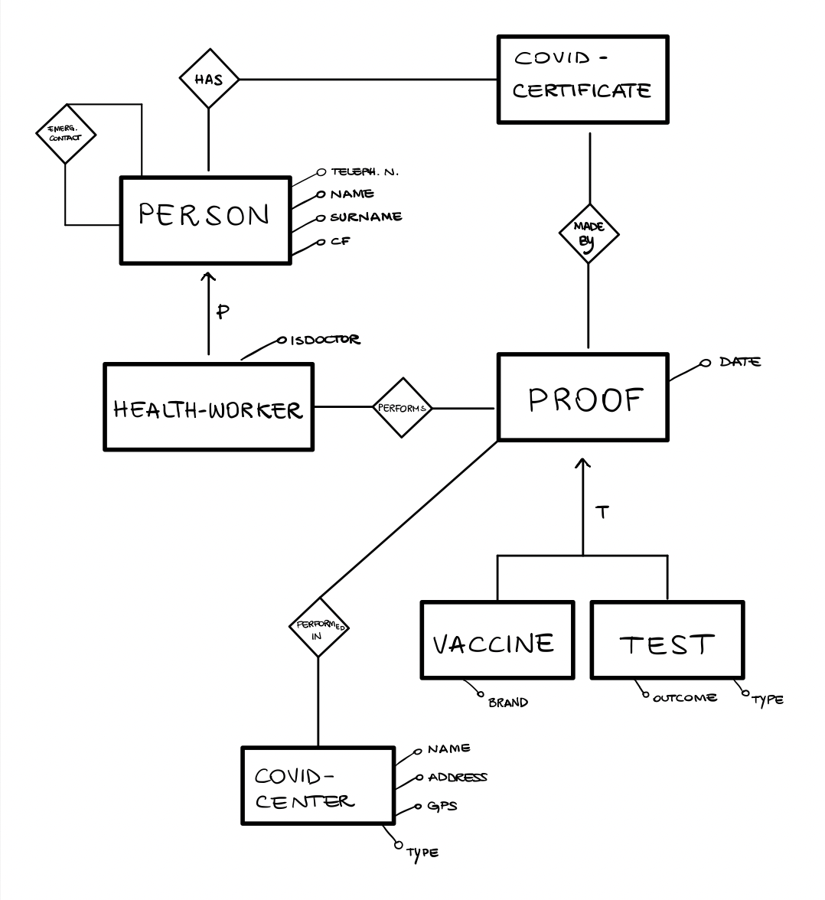
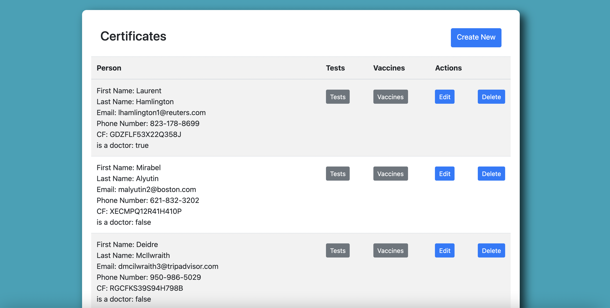
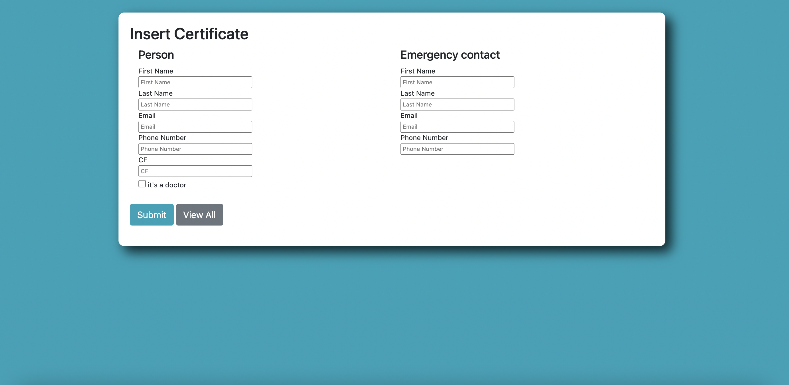

# mongodb-covid19-db

### Purpose
The first project's goal is to trace contacts between people, to monitor the viral diffusion.
It entails the design and implementation of a document-based NoSQL database to support a contact tracing application for COVID-19. 
The data is fake and generated with [mockaroo](https://www.mockaroo.com/) and python scripts. The generated data is in `mongodb/data/certificates.json`.

### Installation

To run the project follow these simple example steps.

1. Install [nodejs](https://nodejs.org/en/download/)
1. run `npm install` (inside directory `mongodb/ui/nodejs`)
1. run `node index.js`

### Features

* Database design
* Database creation using [mockaroo](https://www.mockaroo.com/) and python (see folder script)
* Created queries and commands to use on our database
* Implemented UI to visualize data

The full documentation is available [here](https://github.com/fulcus/mongodb-covid19-db/blob/master/mongodb/docs/Report.pdf).

### ER diagram

### User Interface 

#### Dashboard

The dashboard offers an intuitive interface to visualize, add, remove or modify data.

### Built with

* [mongodb](https://www.mongodb.com)
* [nodejs](https://nodejs.org/)
* [express](https://expressjs.com/)
* [handlebars](https://handlebarsjs.com/)
* python
* [mockaroo](https://www.mockaroo.com/)

## Authors
* [Alice Brugnoli](https://github.com/alicebrugnoli)
* [Leonardo Caponi](https://github.com/leo-capo)
* [Andrea Ceresetti](https://github.com/andreaceresetti)
* [Francesco Gonzales](https://github.com/fulcus)
* [Ginevra Iorio](https://github.com/ginevraiorioo)
